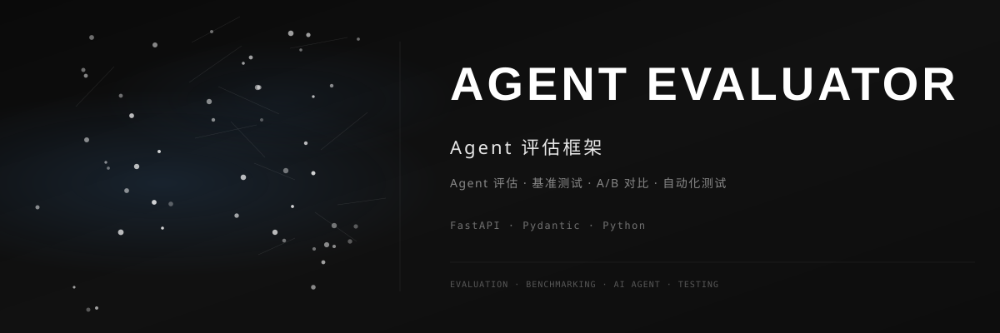

<div align="center">



<br>

### 📊 Agent 评估框架

[](https://github.com/dirjaker/agent_evaluator/stargazers)
[](https://github.com/dirjaker/agent_evaluator/network/members)
[](https://github.com/dirjaker/agent_evaluator/graphs/contributors)
[](https://github.com/dirjaker/agent_evaluator/blob/dev/LICENSE)

</div>

---

## ✨ 功能特性

| 功能 | 描述 |
|------|------|
| 📏 **五维评估** | 准确性、效率、鲁棒性、安全性、可用性全面评估 |
| 🧪 **自动化测试** | 预置测试套件，一键运行 Agent 评估 |
| 📊 **基准数据集** | 内置标准测试数据集，支持自定义数据集 |
| ⚖️ **A/B 对比** | 两个 Agent 版本并行对比分析 |
| 📈 **可视化报告** | 生成评估报告和性能对比图表 |
| 🔌 **多框架支持** | 支持 LangChain、自定义 Agent 等多种框架 |


## 🚀 快速开始

```bash
# 克隆项目
git clone https://github.com/dirjaker/agent_evaluator.git
cd agent_evaluator

# 创建虚拟环境
conda create -n agent_evaluator python=3.12 -y
conda activate agent_evaluator

# 安装依赖
pip install -r requirements.txt

# 运行项目
python main.py
```

## 🛠️ 技术栈

| 层级 | 技术 |
|------|------|
| **后端** | FastAPI, SQLAlchemy, Pydantic |
| **评估引擎** | Python, NumPy, Pandas |
| **可视化** | Matplotlib, Plotly |
| **测试** | pytest, httpx |

## 📝 开发日志

- [x] 五维评估指标体系
- [x] 自动化测试套件
- [x] 基准数据集管理
- [x] A/B 对比分析
- [x] 评估报告生成
- [ ] Web 管理界面
- [ ] 分布式评估
- [ ] CI/CD 集成

## 📄 许可证

[MIT License](LICENSE)

---

<div align="center">

🔗 **GitHub**: [dirjaker/agent_evaluator](https://github.com/dirjaker/agent_evaluator)

⭐ 如果这个项目对你有帮助，请给一个 Star 支持一下！

</div>
